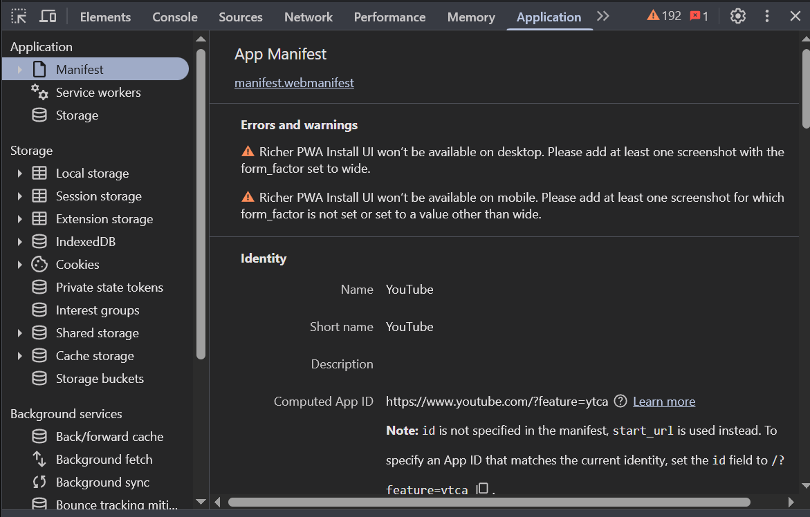
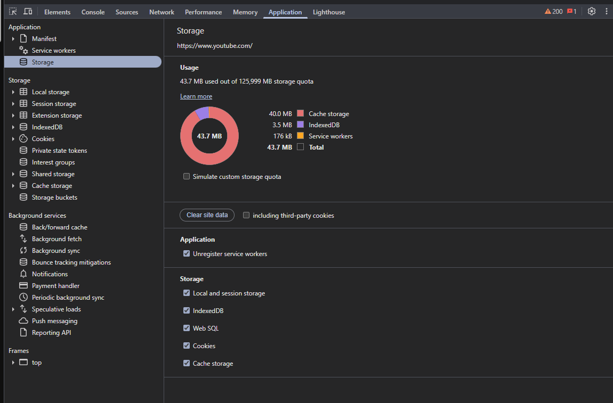
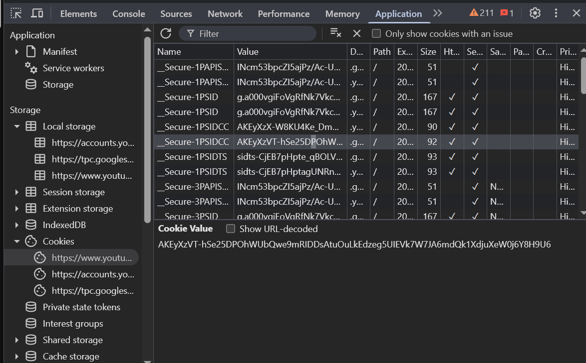
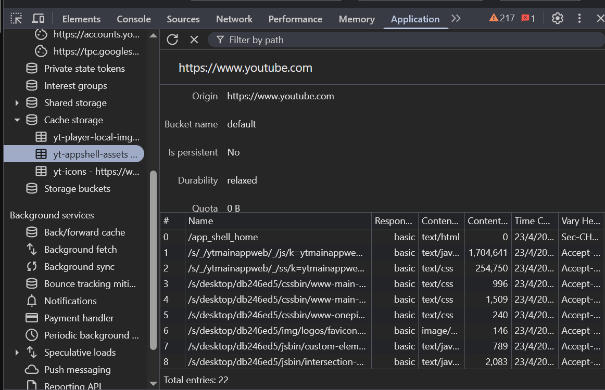
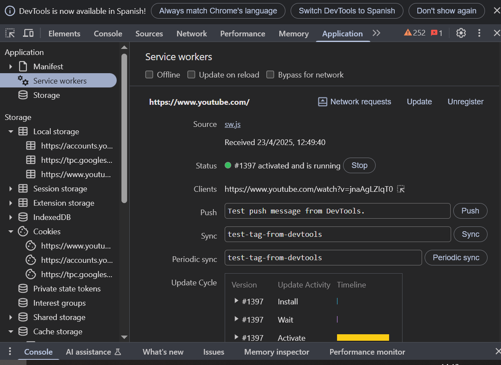
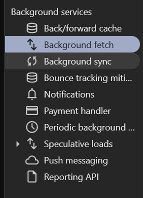

# Application

### 🔹 Manifest
- Información del manifiesto PWA si aplica.

### 🔹 Storage
- Local Storage: clave-valor persistente.
- Session Storage: se borra al cerrar pestaña.
- IndexedDB: base de datos local estructurada.
- Web SQL (obsoleto).

### 🔹 Cookies
- Listado completo con nombre, valor, dominio, expiración, flags.

### 🔹 Cache
- Cache Storage.

- Service Workers.

### 🔹 Background Services
- Push, Notifications, Payment Handler, etc. (visibles si están activos).

---