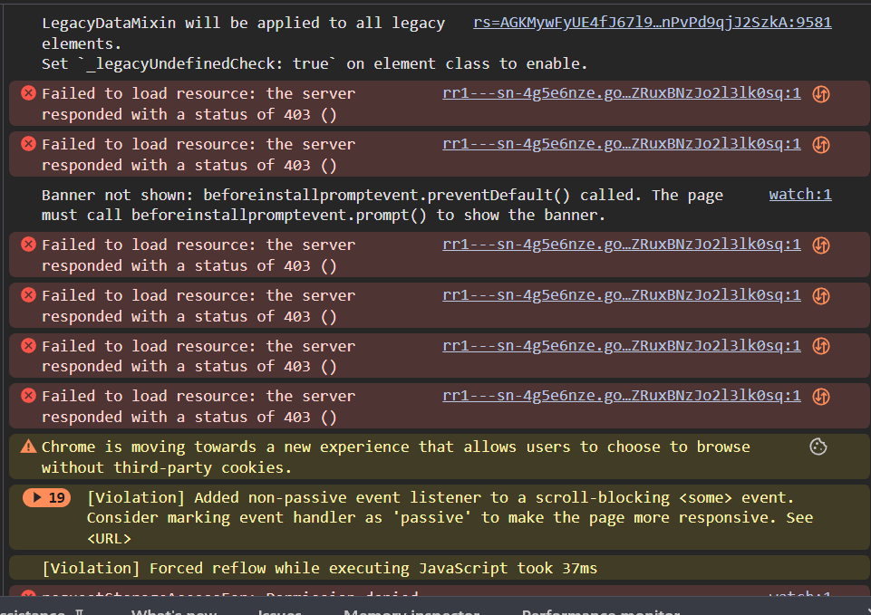
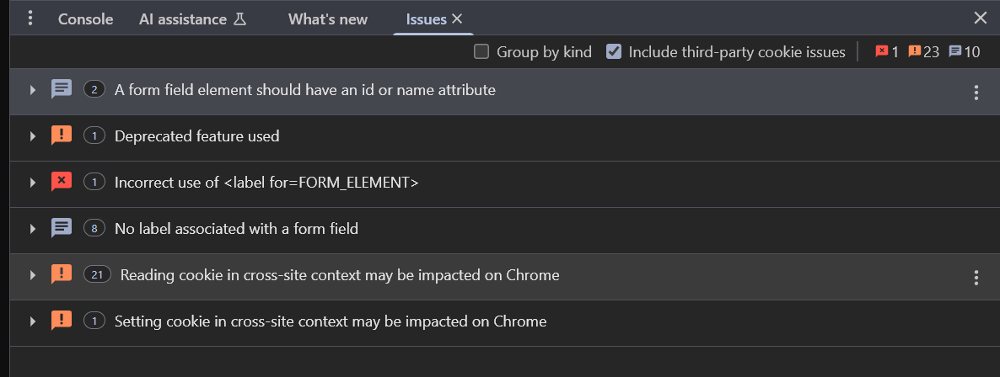

# Console (Consola)
### 🔹 Entrada de comandos
- Ejecutar JavaScript en tiempo real.
- Acceder a variables del contexto.

### 🔹 Logs y errores
- `console.log`, `console.warn`, `console.error`, etc.
- Agrupamiento con `console.group()`.

### 🔹 Comandos especiales
- `$0` a `$4`: Últimos elementos inspeccionados.
- `clear()`: limpia la consola.
- `copy(obj)`: copia el objeto al portapapeles.
- `dir()`, `table()`, `group()`: para estructurar salida.

### 🔹 Auto-completado y ayuda
- Presiona `Tab` para sugerencias.
- Aparece documentación inline al escribir funciones nativas.

---

