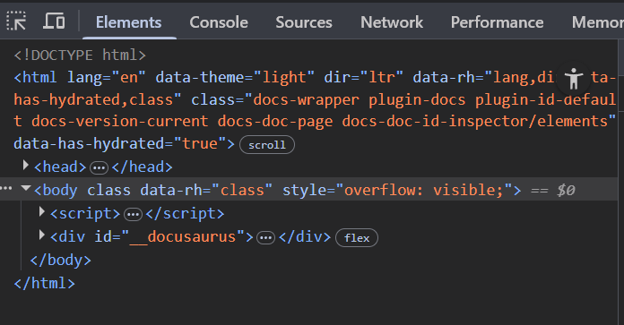
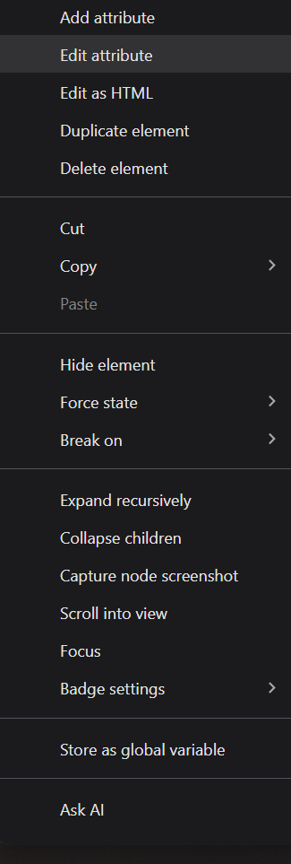
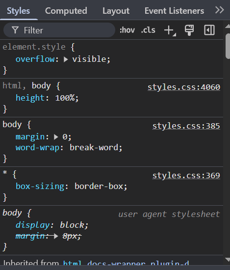
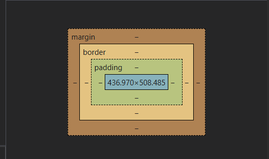
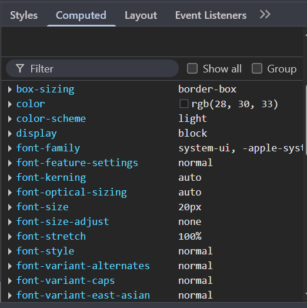
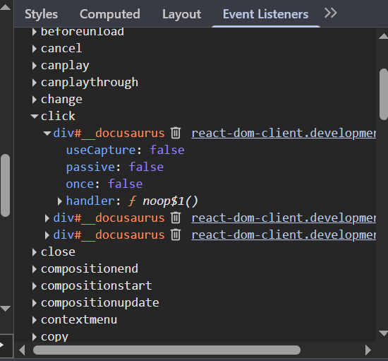

# Elements (Elementos)

### 🔹 Árbol DOM
- Visualización jerárquica del HTML.

- Interacción directa (clic derecho para editar, borrar, copiar, etc).

- $0 – Referencia al último elemento seleccionado.

### 🔹 Panel de estilos
- CSS aplicado al elemento seleccionado.
- Fuente del estilo (archivo o línea).
- Sobrescritura y cascada (tachado si es ignorado).
- Caja de estilos en línea.
- Cambios en vivo: puedes escribir directamente.

### 🔹 Box Model (modelo de caja)
- Visualización gráfica del margen, padding, border y content.
- Puedes editar tamaños directamente desde el diagrama.

### 🔹 Computed (calculado)
- Muestra todos los estilos CSS finales, después de aplicar la cascada y herencia.

### 🔹 Event Listeners
- Muestra eventos asociados al elemento (como click, mouseover).
- Puedes hacer clic en el nombre del archivo JS para ir al código.

---
