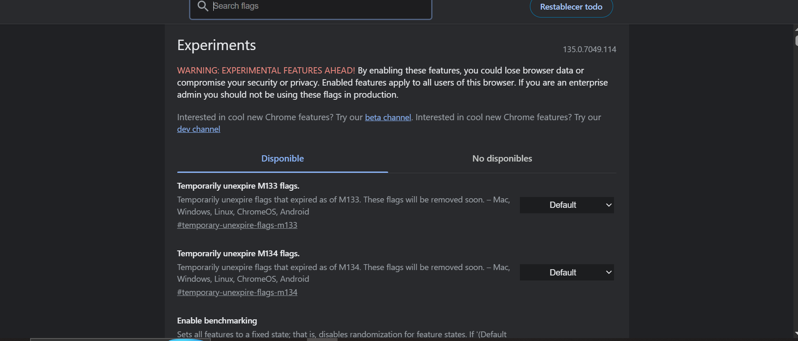
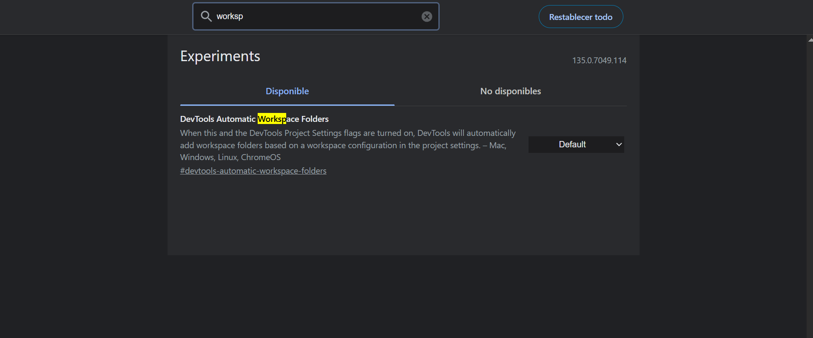

# Experiments (Funciones experimentales)

- Desde `chrome://flags` puedes activar funciones DevTools en desarrollo:
  - Live edit para JS.
  - Workspace (editar código local y que se refleje en la web).
  - Override persistente.
 
  
  

---