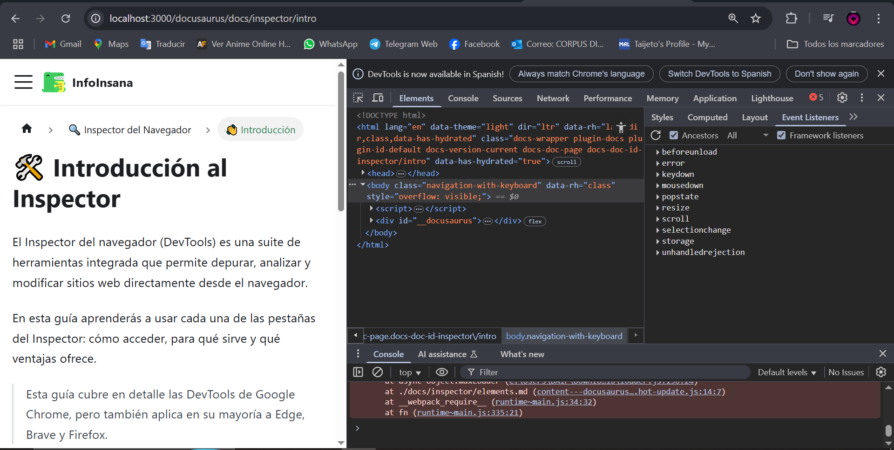

# 🛠️ Introducción al Inspector

El Inspector del navegador (DevTools) es una suite de herramientas integrada que permite depurar, analizar y modificar sitios web directamente desde el navegador, esta es desplgada al presionar F12 y es útil conocer las herramientas que nos ofrece.

En esta guía aprenderás a usar cada una de las pestañas del Inspector: cómo acceder, para qué sirve y qué ventajas ofrece.

> Esta guía cubre en detalle las DevTools de Google Chrome, pero también aplica en su mayoría a Edge, Brave y Firefox.

📚 Continúa con la siguiente sección: **Elements**

