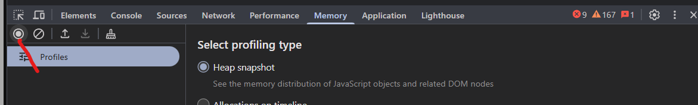
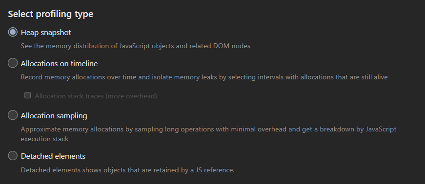
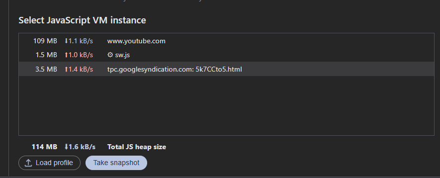

# Memory (Memoria)

### 🔹 Snapshots
- Tomar fotos de uso de memoria.

### 🔹 Allocation instrumentation
- Rastrear asignaciones y pérdidas.

### 🔹 Garbage Collector
- Identificar fugas de memoria (leaks).

---
