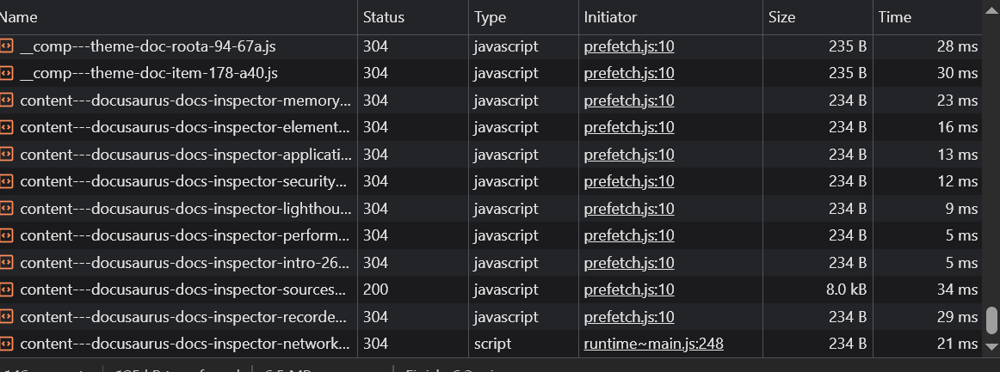
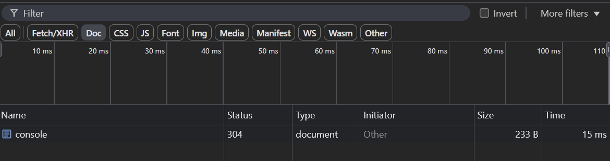
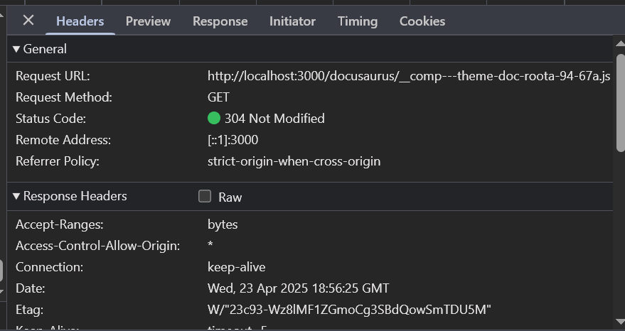
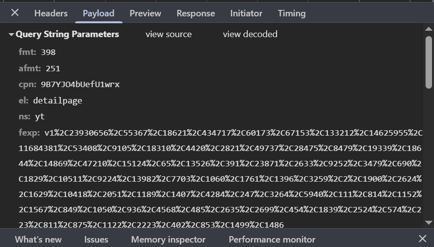
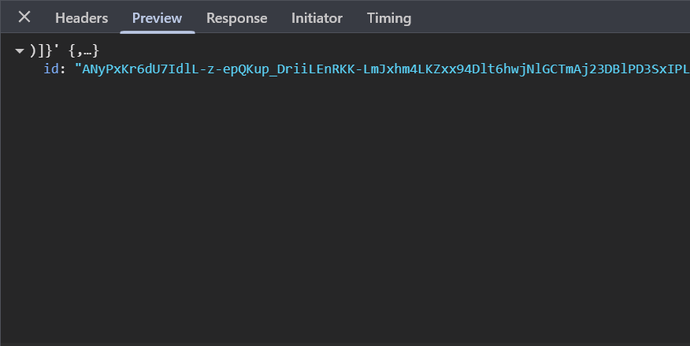
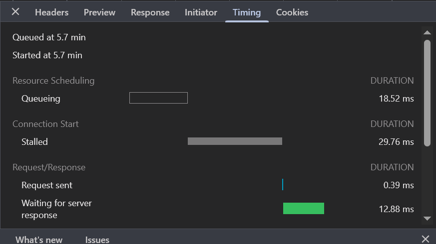
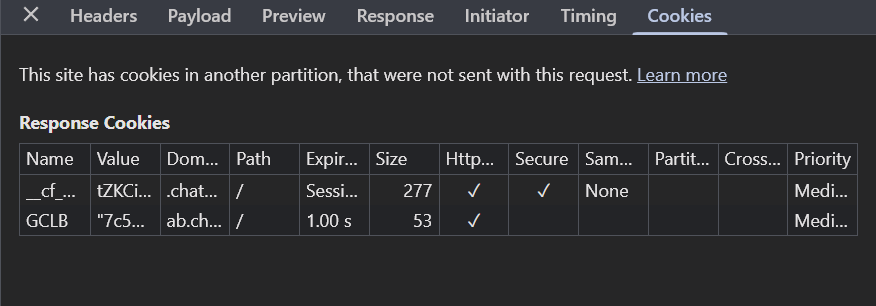
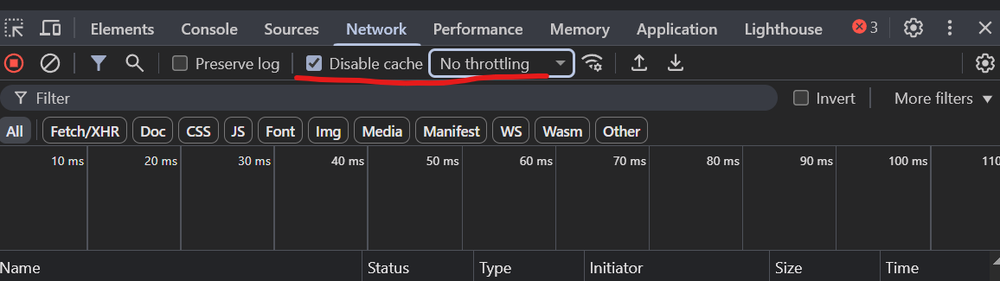

# Network (Red)

### 🔹 Lista de peticiones
- Todas las solicitudes hechas por la página: HTML, JS, CSS, imágenes, fuentes, AJAX, etc.

### 🔹 Filtros por tipo
- Document, Script, XHR, Fetch, Stylesheet, Media, WebSocket, etc.

### 🔹 Detalles de cada petición
- General: URL, método, código de estado.
- Headers: Request y Response Headers.

- Payload: datos enviados.

- Preview: contenido de respuesta.

- Timing: gráfico de tiempos.

- Cookies: asociadas a esa petición.

### 🔹 Throttling y caching
- Simular conexión lenta.
- Desactivar caché del navegador.

---
