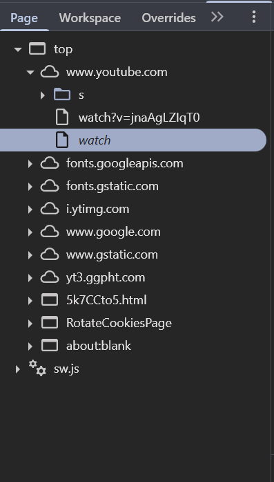
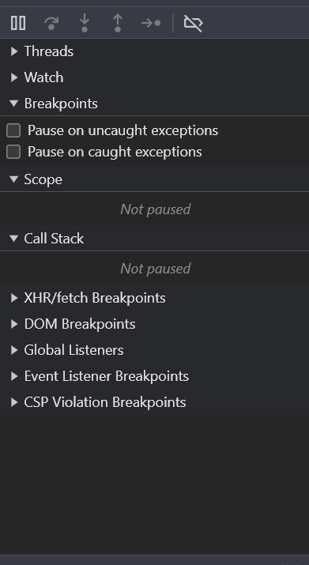
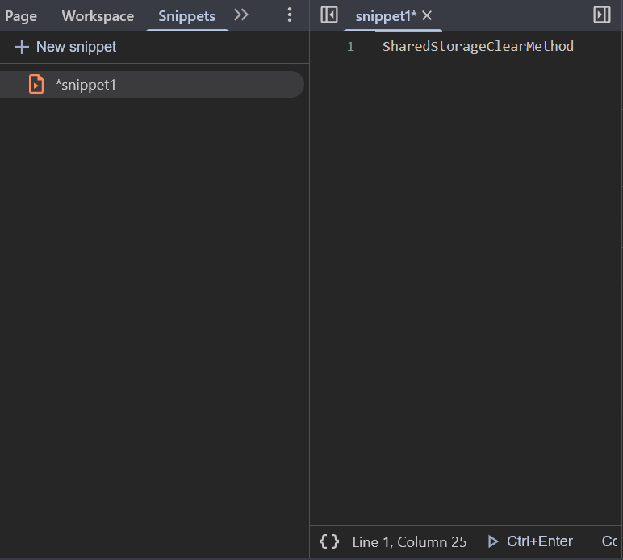
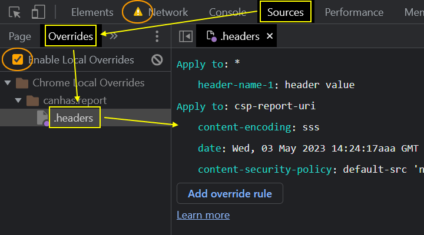

# Sources (Fuentes)

### 🔹 Archivos del sitio
- Navegador tipo árbol: HTML, JS, CSS, imágenes, etc.
- Archivos locales y externos.

### 🔹 Debugger
- Añadir breakpoints (puntos de interrupción).
- Step into, step over, step out.
- Watch expressions, call stack, scopes.

### 🔹 Snippets
- Crear scripts reutilizables.
- Guardar y ejecutar pequeños fragmentos de código.

### 🔹 Overrides
- Sobrescribir archivos locales (requiere habilitar DevTools experimentales).

---
