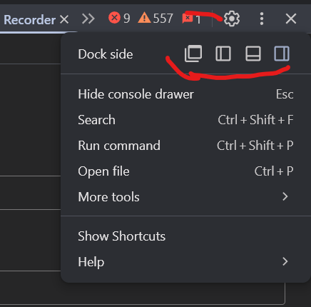
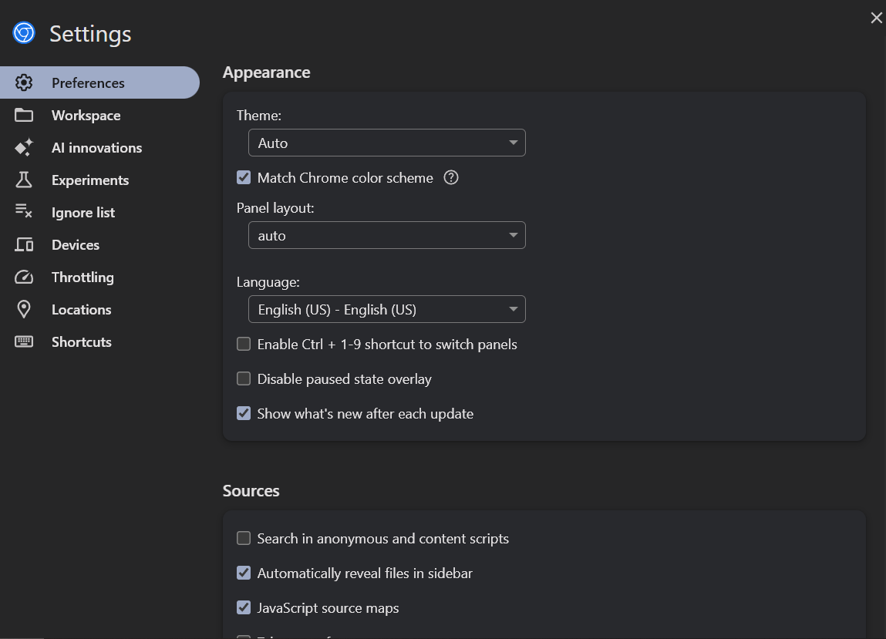

# Tips Pro

- Puedes arrastrar cualquier panel a otra ventana.
- El panel **Dock** permite mover DevTools abajo, a la derecha o en ventana separada.

  

- El botón ⚙️ abre configuraciones donde puedes:
  - Habilitar autocierre de etiquetas.
  - Activar herramientas experimentales.
  - Cambiar temas (oscuro, claro).
  
  

---